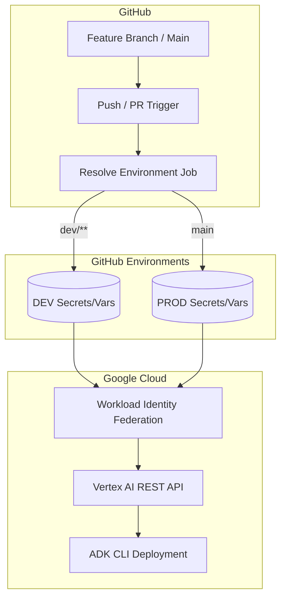

# CI/CD for Agent Engine: A Comprehensive Walkthrough

Welcome! This repository is designed as a learning resource and a starting template for setting up Continuous Integration and Continuous Deployment (CI/CD) for **Google Cloud Vertex AI Agent Engine**. 

This guide walks you through the architecture, logic, and customization options available in this template.

---

## 🏗️ The Architecture

At a high level, deploying an agent to Agent Engine involves packaging your Python code and uploading it to Google Cloud as a managed service. 

Our CI/CD pipeline automates this lifecycle using GitHub Actions:



### Key Components

1.  **`deploy.yml`**: The primary workflow that creates or updates agents.
2.  **`cleanup.yml`**: A "garbage collection" workflow that deletes development agents when their branches are deleted.
3.  **Workload Identity Federation (WIF)**: Our keyless authentication method. It establishs a trust relationship between GitHub and GCP so we don't need to store sensitive JSON keys.
4.  **GitHub Environments**: Used to scope secrets (like WIF Providers) and variables (like Project IDs) to specific deployment targets (DEV vs PROD).

---

## 🚀 The Deployment Workflow (`deploy.yml`)

This workflow uses a **two-step "Plan & Apply"** pattern tailored for Vertex AI Agent Engine.

### 1. The Router (`resolve-environment`)

The first job acts as a router. It analyzes the GitHub context to decide *which* environment to target.

- **Convention**: `main` branch targets the `PROD` environment.
- **Convention**: `dev/**` branches target the `DEV` environment.

**Why do it this way?** This allows one workflow file to handle multiple projects or stages simply by adding more `elif` blocks to the routing logic.

### 2. The Executor (`deploy`)

This job performs the actual deployment using the [Google ADK CLI](https://google.github.io/adk-docs/).

#### In-Place Updates vs. New Creations
To ensure we don't create duplicate agents for every push, the workflow first queries the Vertex AI REST API.
- If an agent with the matching **Display Name** exists, we capture its ID and perform an **Update**.
- If no matching agent is found, we perform a **New Deployment**.

### 🛡️ Concurrency & Deduplication

We use GitHub's `concurrency` feature to ensure that if a developer pushes code twice in 30 seconds, the first (now stale) deployment is automatically canceled. This saves GCP costs and CI minutes.

```yaml
concurrency:
  group: ${{ github.workflow }}-${{ github.base_ref || github.ref_name }}
  cancel-in-progress: true
```

---

## 🧹 The Cleanup Workflow (`cleanup.yml`)

Infrastructure hygiene is critical when using dynamic development environments. The `cleanup.yml` workflow listens for the `delete` event (branch deletion).

### The "Skip Notification" Logic
You may notice this workflow "runs" on every branch deletion. Because GitHub doesn't support branch filters for the `delete` event, we use an `if` gate at the job level:

```yaml
if: github.event.ref_type == 'branch' && startsWith(github.event.ref, 'dev/')
```

**What this means:** GitHub triggers the workflow, checks the condition, and if it's NOT a `dev/` branch, the job is **skipped** in milliseconds without using any runner resources.

---

## 🛠️ Customizing and Scaling

### Changing Naming Conventions

By default, we use the branch name (e.g., `dev/pirate`) as the Agent Engine **Display Name**. You can change this in `deploy.yml` inside the `resolve-environment` job.

**Example: Adding a Repo Prefix**
```bash
# Change:
DISPLAY_NAME="$TARGET_BRANCH"
# To:
DISPLAY_NAME="my-project-${TARGET_BRANCH////-}"
```

### Scaling to More Environments (QA, Staging)

Adding a `QA` environment is a 3-step process:

1.  **GCP**: Create a new GCP project (or just a new region).
2.  **GitHub**: Create a new GitHub Environment called `QA` with its own `GCP_PROJECT_ID`.
3.  **Workflow**: Add the routing logic to `deploy.yml`:
    ```bash
    elif echo "$TARGET_BRANCH" | grep -q "^qa/"; then
      ENV="QA"
      DISPLAY_NAME="Quality Assurance"
    ```

---

## 🔐 Security Best Practices

We strictly follow the **Principle of Least Privilege**:
- **WIF**: No long-lived keys. If GitHub is compromised, there are no static credentials to steal.
- **Permissions**: The GitHub token used during the run has `id-token: write` but only `contents: read`. It can authenticate to GCP but cannot modify your source code.
- **Environment Secrets**: PROD secrets are unreachable by runs on `dev/` branches, preventing accidental production outages during testing.
